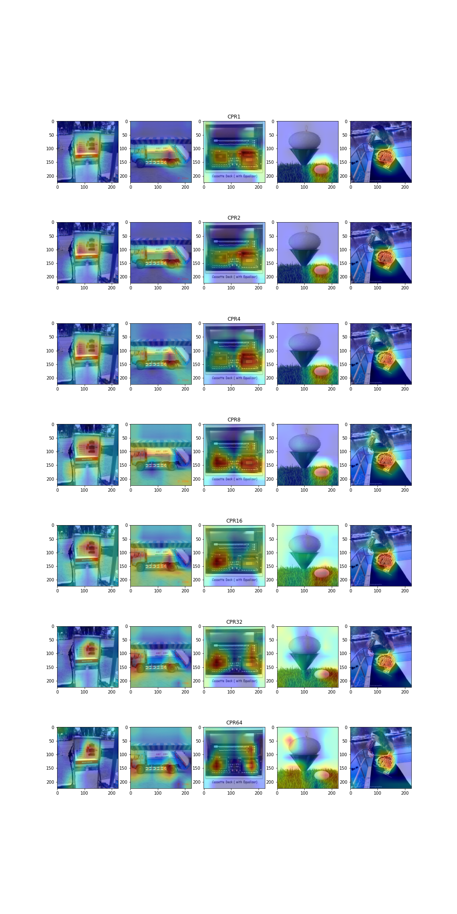
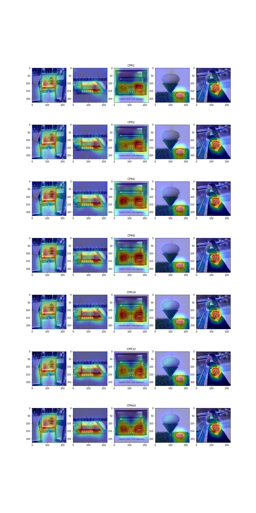
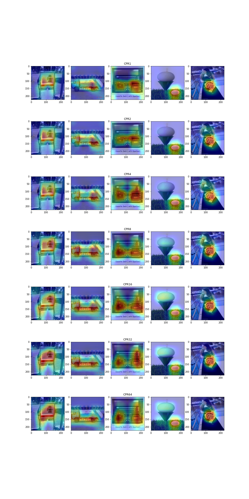
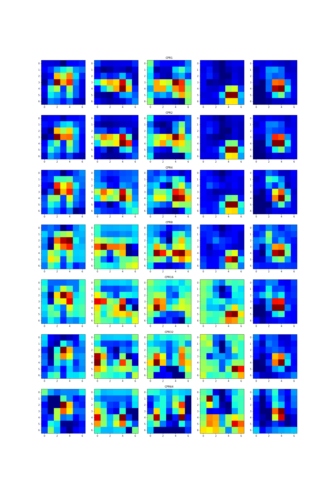
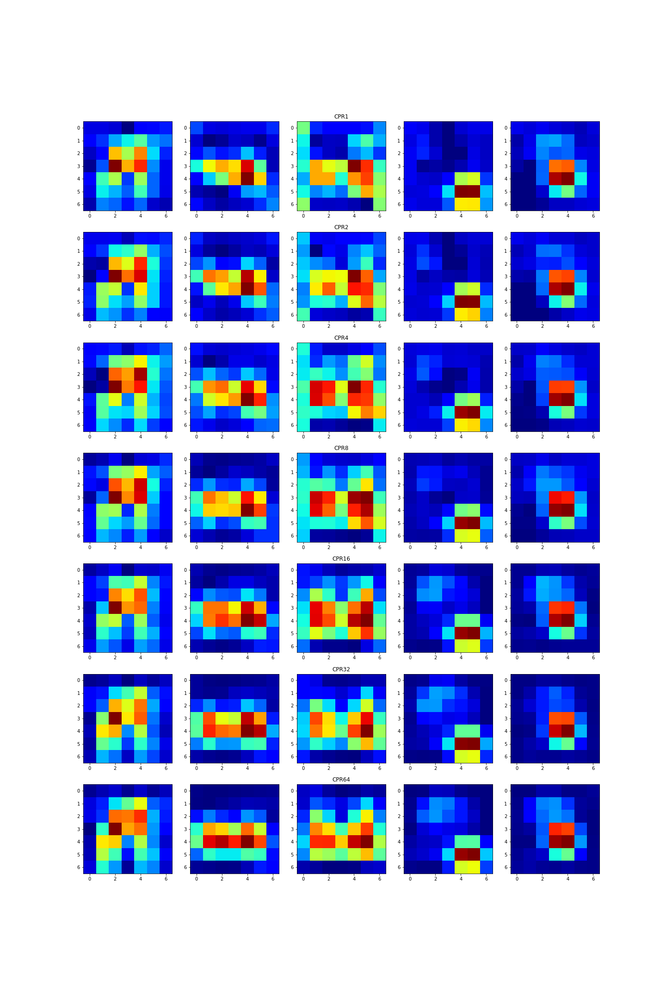
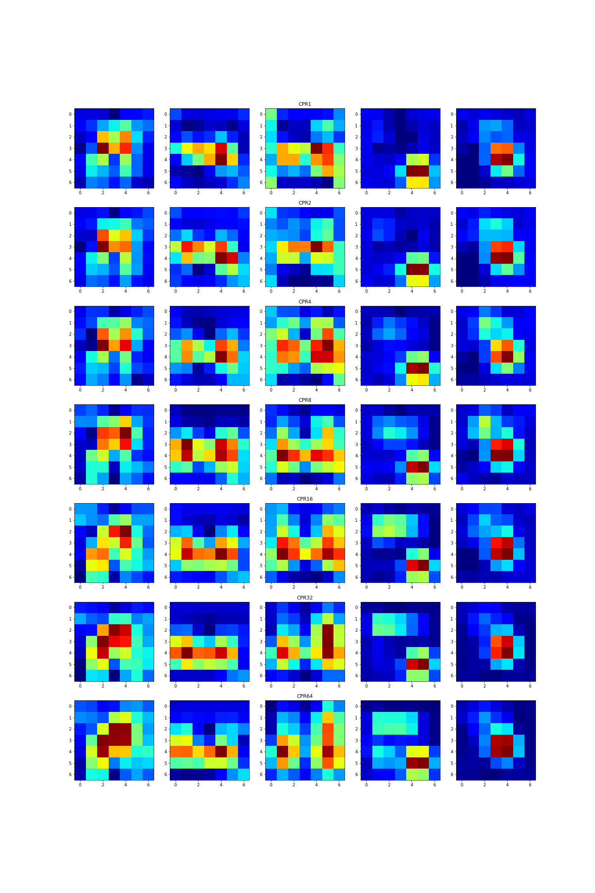

# Pruning and Explainability
This repository contains additional experiments that build upon our research paper [Less is More: The Influence of Pruning on the Explainability of CNNs
](https://arxiv.org/abs/2302.08878). The acompanying code can be found [here](https://github.com/FlorianMerkle/pruning_for_explainability).

I was experimenting with quantitative measures for the quality of GradCAM explainability maps.

I also looked into how limit pruning to certain modules of a CNN impacts the creation of GradCAM heatmaps. Interestingly, it appears that pruning the linear layers of a CNN might lead to more concise heatmaps, while extensive pruning of the convolutional layers at some point will lead to dispersed heatmaps:

Convolutional layers only             |  Linear layers only              |  All layers
:-------------------------:|:-------------------------:|:-------------------------:
  |   | 
  |   | 
